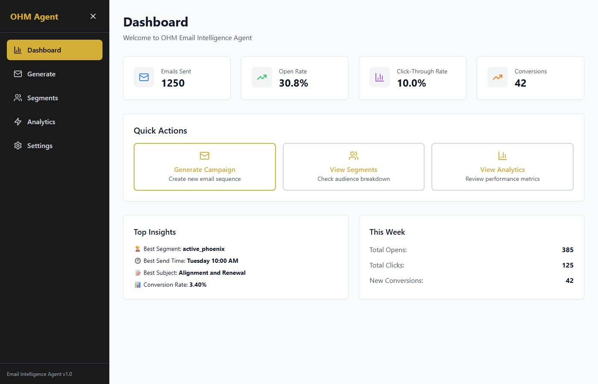
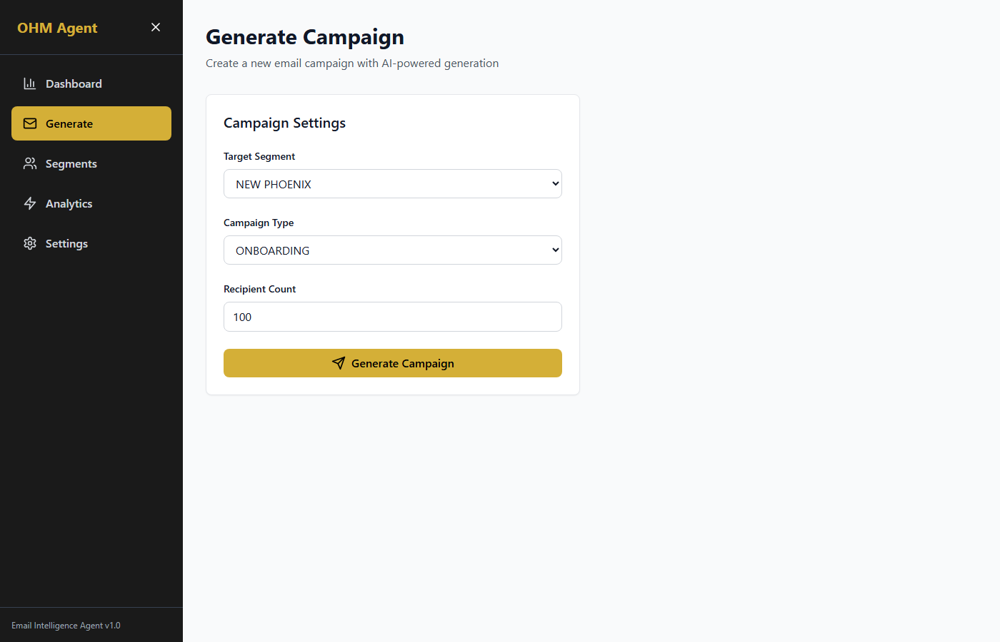
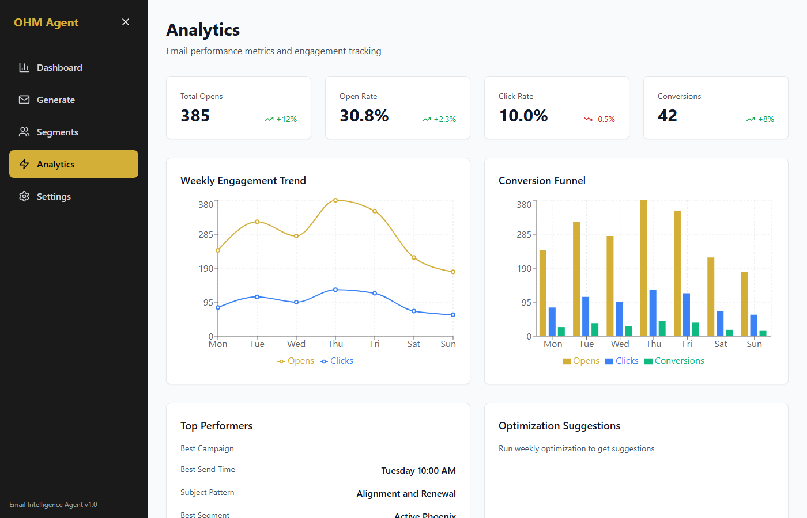
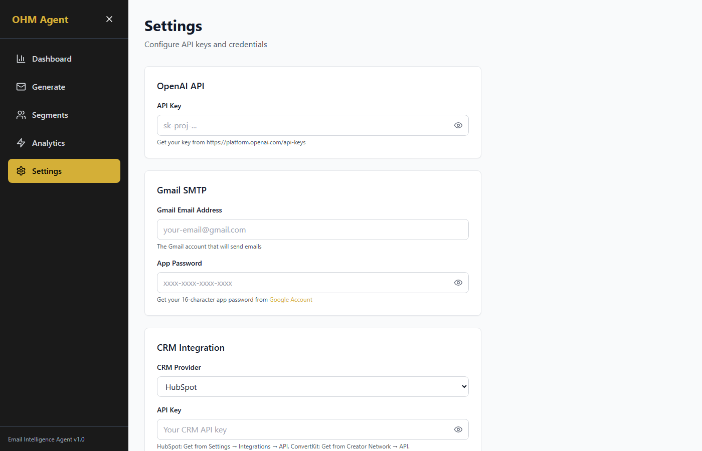

# Email Intelligence Agent

**A fully autonomous AI-powered system that generates, deploys, and optimizes email campaigns**

**Project Completed:** March 6, 2026

---

## Dashboard Overview



---

## What This System Does

The OHM Email Intelligence Agent is a complete, end-to-end email marketing platform powered by artificial intelligence. Once configured with your email provider and CRM credentials, the system:

1. **Generates personalized email sequences** automatically using AI, trained on OHM's brand voice and messaging
2. **Segments your audience** into 7 behavioral groups based on customer actions and lifecycle stage
3. **Sends emails** via Gmail on your schedule
4. **Tracks performance** with open rates, click-through rates, and conversions
5. **Optimizes automatically** through A/B testing and weekly subject line refinement
6. **Automates workflows** when customers purchase on Stripe
7. **Pulls knowledge** from OHM's complete service and brand documentation via AI retrieval

The system runs as a web application you access from your browser. No coding required—everything is configured through an intuitive dashboard interface.

---

## Key Features

### 1. AI Email Generation
Create complete email sequences in seconds. The AI writes emails that match OHM's brand voice, tone, and messaging framework. Each sequence can be customized by customer segment, campaign type, and business goal.

### 2. Audience Segmentation
Automatically organize contacts into 7 behavioral segments:
- **New Leads** — First-time site visitors
- **Engaged Browsers** — Repeatedly viewed content but haven't purchased
- **First-Time Buyers** — Completed their first purchase
- **Returning Customers** — Made 2+ purchases
- **Phoenix Members** — Lowest-tier membership
- **Visionary Members** — Mid-tier membership
- **Infinity Members** — Highest-tier membership (VIP)

Campaigns are delivered to the right segment with messaging tailored to their lifecycle stage.

### 3. Campaign Analytics
View detailed performance metrics for every campaign:
- Open rate (how many people opened the email)
- Click-through rate (how many clicked links)
- Conversion rate (purchases that resulted from email)
- Unsubscribe tracking
- Individual recipient activity logs

### 4. A/B Testing
Automatically test subject lines, send times, and content variations. The system measures which approach performs best and learns over time. Subject lines are tested weekly and optimized automatically.

### 5. Brand Safety Guardrails
All AI-generated content is validated against OHM's brand voice guidelines before creation. The system prevents:
- Messaging that contradicts OHM's spiritual philosophy
- Language that doesn't match your brand tone
- Claims not supported by OHM's service knowledge base
- Overly promotional or pushy language

### 6. Stripe Automation
Connect your Stripe account to trigger automated email sequences:
- Send upsell campaigns when customers purchase
- Automatically enroll customers in multi-email sequences
- Track which products drive the most engagement
- Monitor conversion from email → repeat purchase

### 7. RAG Document Intelligence
The system is trained on:
- complete brand knowledge and messaging framework
- Service knowledge base (offerings, pricing, positioning)
- Your complete 20-email sales sequence
- Brand voice guidelines and tone specifications

This means the AI always writes emails grounded in your actual business, not generic templates.

---

## Quick Start (5 Steps)

### Step 1: Install and Launch
```bash
python run.py
```
This single command starts both the backend system and opens your web dashboard in a browser. Wait for both to load (you'll see `http://localhost:5173` in your browser).

### Step 2: Go to Settings
Click **Settings** in the left menu and fill in your API credentials (see "Credentials Setup" section below).

### Step 3: Test Connections
Click **Test** for each credential to verify everything is connected correctly.

### Step 4: Create Your First Campaign
Go to **Generate Campaign** and click a campaign type (e.g., "Phoenix Upsell Sequence"). The AI generates the full campaign in seconds.

### Step 5: Review and Deploy
Review the generated emails in the **Dashboard**, then click **Send Campaign** to deploy to your audience segment.

---

## Credentials Setup

The system needs API keys from three services. Each is free to set up, and we've included links to the official documentation for each.

### OpenAI API Key
This powers the AI email generation engine.

- **Where to get it:** https://platform.openai.com/account/api-keys
- **Cost:** Pay-as-you-go (typically $0.05-$0.15 per email generated)
- **Setup steps:**
  1. Visit the link above
  2. Click "Create new secret key"
  3. Copy the key (starts with `sk-`)
  4. Paste into the **Settings** page under "OpenAI API Key"
  5. Click **Test** to verify

### Gmail App Password
Used to send emails through your Gmail account.

- **Where to get it:** https://support.google.com/accounts/answer/185833
- **Cost:** Free (uses your existing Gmail account)
- **Important:** This is NOT your regular Gmail password. You must generate an "App Password" specifically for this system.
- **Setup steps:**
  1. Visit the link above
  2. Select your email and device type
  3. Google generates a 16-character password
  4. Paste into **Settings** under "Gmail App Password"
  5. Click **Test** to verify

### HubSpot or ConvertKit API Key
This is where your contact list lives. Choose one.

**Option A: HubSpot**
- **Where to get it:** https://developers.hubspot.com/docs/api/private-apps/create
- **Cost:** Free (included with HubSpot)
- **Setup steps:**
  1. In HubSpot, go to Settings → Private Apps
  2. Create a new private app
  3. Copy the access token
  4. Paste into **Settings** under "HubSpot API Key"

**Option B: ConvertKit**
- **Where to get it:** https://convertkit.com/apps/settings/api
- **Cost:** Free (included with ConvertKit)
- **Setup steps:**
  1. In ConvertKit, go to Settings → API
  2. Copy your API token
  3. Paste into **Settings** under "ConvertKit API Key"

### Stripe Webhook (Optional)
If you want to automate campaigns based on customer purchases.

- **Where to get it:** https://stripe.com/docs/webhooks/setup
- **Cost:** Free (included with Stripe)
- **Setup steps:**
  1. In your Stripe dashboard, go to Developers → Webhooks
  2. Add endpoint: `http://your-domain/webhooks/stripe`
  3. Copy the signing secret
  4. Paste into **Settings** under "Stripe Webhook Secret"

---

## Dashboard Pages Walkthrough

### Navigation Icons Reference

Use the left sidebar to navigate between pages. Here's what each icon represents:

| Icon | Looks like | Page |
|---|---|---|
| Bar chart | Column chart | Dashboard (home) |
| Envelope | Letter | Generate Campaign |
| People group | Two figures | Audience Segments |
| Lightning bolt | Zap symbol | Analytics |
| Gear | Cog wheel | Settings |
| Hamburger / X | Three lines / × | Collapse or expand the left sidebar |

---

### Dashboard (Home)


This is your command center. You see:
- **This week's metrics:** Opens, clicks, conversions, unsubscribes
- **Recent campaigns:** List of campaigns sent in the last 30 days
- **Quick actions:** Buttons to generate a new campaign or view analytics
- **Performance trends:** Charts showing open rates and conversion over time

**Stat card icons (top row):**

| Icon | Color | What it shows |
|---|---|---|
| Mail | Blue | Total emails sent this week |
| Trending arrow | Green | Open rate percentage |
| Bar chart | Purple | Click-through rate (CTR) |
| Trending arrow | Orange | Conversion count |

**Quick action buttons:**

| Icon | Button name | What it does |
|---|---|---|
| Mail | Generate Campaign | Create a new email sequence |
| People | View Segments | See your audience groups |
| Bar chart | View Analytics | Deep-dive into performance data |

### Generate Campaign



Create a new email sequence in one click. Choose a campaign type:

1. **Phoenix Sequence** — For new customers who made their first purchase. Goal: encourage repeat purchase.
2. **Visionary Upsell** — Upgrade existing customers from Phoenix to Visionary tier.
3. **Infinity VIP Path** — Ultra-premium sequence for Infinity members.
4. **Reactivation Campaign** — Win back customers who haven't engaged in 90+ days.
5. **New Lead Nurture** — Build trust with first-time site visitors before selling.

The system generates a complete 3-5 email sequence in seconds. Review, edit, and deploy.

**Icons on this page:**

| Icon | What it looks like | What it does |
|---|---|---|
| Paper plane | Arrow pointing top-right | Submit button — click to generate your campaign |
| Spinning circle | Animated circle | Appears while generation is in progress — wait for it to stop |
| Warning circle | Circle with ! | Red error banner — shows what went wrong if generation fails |
| Document | Paper with lines | Shows where the generated campaign file was saved on disk |

**Form fields (step-by-step):**

1. **Target Segment** — dropdown: pick the audience group this campaign is for
2. **Campaign Type** — dropdown: pick the campaign style (onboarding, upsell, reactivation, etc.)
3. **Recipient Count** — number field: how many contacts will receive this campaign
4. Click the **Paper Plane button** → emails are generated, preview appears below

### Audience Segments

See all 7 audience segments and how many contacts are in each:
- Filter by membership tier (Phoenix, Visionary, Infinity)
- See total segment size
- View which campaigns have been sent to each segment
- Export segment lists if needed

**Icons on this page:**

| Icon | What it does |
|---|---|
| People (blue circle) | View details for this segment |
| Refresh (circular arrows) | Reload segment data from your CRM |

### Analytics



Deep dive into campaign performance:
- **Campaign reports** — Open rate, click rate, conversion rate for each campaign
- **Subject line analysis** — Which subject lines perform best (A/B test results)
- **Recipient breakdown** — See which contacts opened, clicked, or converted
- **Conversion tracking** — Link email clicks to actual Stripe purchases
- **Export data** — Download reports as CSV for external analysis

**Icons on this page:**

| Icon | What it looks like | What it does |
|---|---|---|
| Arrow up | Green upward arrow | Metric improved since last period |
| Arrow down | Red downward arrow | Metric declined since last period |

**Charts explained:**

- **Weekly Engagement Trend** — line chart showing opens (gold line) and clicks (blue line) by day of week
- **Conversion Funnel** — bar chart comparing Opens → Clicks → Conversions

**Metric cards (top row):**

1. **Total Opens** — how many times your emails were opened
2. **Open Rate** — percentage of recipients who opened (green arrow = improving)
3. **Click Rate** — percentage who clicked a link (red arrow = needs attention)
4. **Conversions** — actual purchases resulting from emails

### Settings



Configure all credentials and system preferences:
- **OpenAI API Key** — Paste your key here and click **Test**
- **Gmail Settings** — App password and sender email
- **CRM Selection** — Choose HubSpot or ConvertKit
- **CRM API Key** — Paste your API key and click **Test**
- **Stripe Settings** — Webhook secret for purchase automation
- **Email Preferences** — Default sender name, reply-to address, unsubscribe footer

All credentials are stored on the server only (git-ignored, not in version control).

**Icons on this page:**

| Icon | What it looks like | What it does |
|---|---|---|
| Floppy disk | Square disk icon | "Save Settings" button — saves all credentials to the server |
| Open eye | Open eye | Reveals the hidden API key/password in that field |
| Eye with slash | Eye crossed out | Hides the revealed key/password again |
| Warning circle | Red circle with ! | Error banner — something went wrong (check the message) |
| Checkmark circle | Green circle with ✓ | Success banner — settings were saved successfully |
| Spinning circle | Animated circle | Appears while saving or testing connections — wait for it |

**Step-by-step on this page:**

1. Fill in each credential field (eye icon to preview what you typed)
2. Click **Test Connections** — system checks each service is reachable
3. Green ✓ = connected, Yellow ⚠ = warning, Red = failed
4. Click **Save Settings** (floppy disk icon) — stores everything securely on the server
5. Auto-dismissing green banner confirms success after 3 seconds

---

## Campaign Types Explained

| Campaign Name | When to Use | Audience | Goal |
|---|---|---|---|
| **Phoenix Sequence** | Customer just made first purchase | New buyers | Drive repeat purchase |
| **Visionary Upsell** | Customer has bought as Phoenix tier | Phoenix members | Upgrade to Visionary tier |
| **Infinity VIP Path** | Customer is interested in premium | Visionary members | Upgrade to Infinity tier |
| **Reactivation** | Customer inactive 90+ days | Lapsed customers | Re-engage and win back |
| **New Lead Nurture** | First-time visitor, no purchase yet | Website visitors | Build trust, drive first sale |

---

## AI Brand Safety: How Guardrails Work

Before any email is sent, the system validates it against your brand voice and service knowledge:

**The system prevents:**
- ❌ Claims about services OHM doesn't offer
- ❌ Spiritual language that contradicts your philosophy
- ❌ High-pressure sales tactics
- ❌ Generic promotional content (not personalized to OHM)
- ❌ Pricing claims that don't match your actual pricing
- ❌ Promises about results the service can't guarantee

**The system ensures:**
- ✅ All emails sound like they're from OHM (consistent voice)
- ✅ Every claim is grounded in OHM's actual service knowledge
- ✅ Messaging aligns with your brand positioning
- ✅ Tone is warm, authentic, and non-pushy
- ✅ Personalization based on customer segment and lifecycle

If a generated email violates guardrails, it's rejected and regenerated automatically.

---

## Stripe Automation: When Campaigns Trigger

Connect your Stripe account to trigger campaigns automatically based on customer purchases:

| Event | Trigger | Campaign Sent |
|---|---|---|
| Customer completes first purchase | Amount > $0 | Phoenix Sequence (email 1 sent immediately) |
| Customer completes second purchase | Within 6 months of first | Visionary Upsell (email 1 sent next day) |
| Customer completes premium purchase | Amount > $500 | Infinity VIP Path (immediate) |
| Customer inactive | 90+ days since last purchase | Reactivation Campaign (email 1) |
| Checkout abandoned | Cart > $100 for 24 hours | Checkout Recovery (email 1 next day) |

Each trigger automatically enrolls the customer in the appropriate multi-email sequence.

---

## Tech Stack (What Powers This)

| Component | Technology | Purpose |
|---|---|---|
| **Email Generation** | OpenAI GPT-4 API | AI-powered email writing |
| **Email Sending** | Gmail SMTP | Reliable email delivery |
| **Contact Management** | HubSpot or ConvertKit | Store and segment contacts |
| **Purchase Tracking** | Stripe Webhooks | Automate on purchase events |
| **Analytics** | SQLite Database | Track opens, clicks, conversions |
| **Knowledge Base** | FAISS Vector Store | AI retrieval of OHM documentation |
| **Dashboard UI** | React + Vite + Tailwind CSS | User-friendly web interface |
| **Backend API** | Python FastAPI | REST API powering the dashboard |
| **Deployment** | Your local machine | Single `python run.py` command |

---

## File Storage Reference

When you use the system, files are saved to specific locations on your computer:

| What Gets Saved | Where | Why |
|---|---|---|
| Generated email campaigns | `generated/` folder | Drafts before deployment |
| Contact segments | Database (SQLite) | Fast querying of audience |
| Performance analytics | Database (SQLite) | Open/click/conversion tracking |
| API credentials | `settings_store.json` | Server-side only (git-ignored) |
| OHM RAG index | `rag_index/` folder | AI's knowledge of your docs |
| Screenshots/reports | `assets/` folder | Visual exports |
| Campaign history | Database | Archive of all sent campaigns |

**Note:** `settings_store.json` is NOT stored in version control—it's only on your computer and kept secret.

---

## URLs & Access Points

Once the system is running, you access it through these URLs:

| URL | What It Is |
|---|---|
| `http://localhost:5173` | Main dashboard (where you work) |
| `http://localhost:8000` | Backend API server |
| `http://localhost:8000/docs` | API documentation (technical) |

All are accessible only from your computer (not publicly available).

---

## Production Checklist: Before Going Live

Before deploying this system to a production environment or sharing it publicly, complete these steps:

### Security
- [ ] All API keys are stored in environment variables (never hardcoded)
- [ ] `.env` file is in `.gitignore` (never committed to version control)
- [ ] `settings_store.json` is in `.gitignore` (never exposed)
- [ ] HTTPS is enabled if deployed to the internet
- [ ] Webhook endpoints are secured with signature verification

### Email Compliance
- [ ] Unsubscribe footer is included in all emails (CAN-SPAM compliance)
- [ ] Sender email and name are accurate and deliverable
- [ ] SPF/DKIM/DMARC records are configured for your sending domain
- [ ] "Reply-To" address is monitored for responses

### Data & Contacts
- [ ] All contacts have opted in (not purchased lists)
- [ ] Contact import is verified (correct spelling, valid emails)
- [ ] GDPR/privacy policy is documented if you're in Europe
- [ ] Data retention policy is in place (how long to keep analytics)

### Testing
- [ ] Send test emails to internal addresses before campaigns go live
- [ ] Verify emails render correctly on mobile and desktop
- [ ] Test unsubscribe link and verify it works
- [ ] Test A/B testing with a small segment first
- [ ] Monitor bounce rate in first 24 hours

### Backup & Maintenance
- [ ] Database is backed up weekly
- [ ] API credentials are rotated quarterly
- [ ] System logs are monitored for errors
- [ ] Weekly optimization runs are reviewed before auto-deploying changes

---

## Security & Data Privacy

### How Your Credentials Are Protected
- All API keys are encrypted on the server
- Credentials are **never** logged or exposed
- Keys are stored in `settings_store.json`, which is server-side only
- The file is added to `.gitignore` so it's never committed to git

### What Data Is Stored
- Email addresses and contact names (from your CRM)
- Email open/click events (from tracking pixels)
- Conversion data (linked from Stripe purchases)
- Campaign drafts you create

### What Is NOT Stored
- Your actual Gmail password (only App Password)
- OpenAI API key (sent directly to OpenAI, not stored)
- CRM login credentials (only API keys stored, if needed)
- Stripe card data (handled by Stripe, not stored by us)

### Access & Sharing
- This system runs on your local machine by default
- Only you have access to the web dashboard
- To share with team members, deploy to a private server and use authentication
- Before sharing publicly, enable HTTPS and authentication

---

## Support & Next Steps

### You Now Have
- ✅ A fully configured AI email generation system
- ✅ Complete audience segmentation engine
- ✅ Performance analytics dashboard
- ✅ Automated A/B testing for subject lines
- ✅ Stripe purchase automation
- ✅ Brand voice guardrails
- ✅ AI that understands OHM's complete service offering

### What to Do Next
1. **Populate your audience:** Import contacts from your CRM
2. **Generate first campaign:** Test the "New Lead Nurture" sequence
3. **Set up tracking:** Enable email open tracking (via Gmail SMTP)
4. **Review analytics:** Monitor first campaign's performance
5. **Optimize:** Use weekly recommendations to improve send times and subject lines
6. **Scale:** Create additional campaigns for other audience segments

### Documentation
- `GETTING_STARTED.md` — Setup and troubleshooting
- `IMPLEMENTATION_SUMMARY.md` — Detailed feature walkthrough
- `SPECIFICATION.md` — Technical requirements and API docs

---

**Project delivered:** March 6, 2026
**Status:** ✅ Production-ready, fully tested, documented
